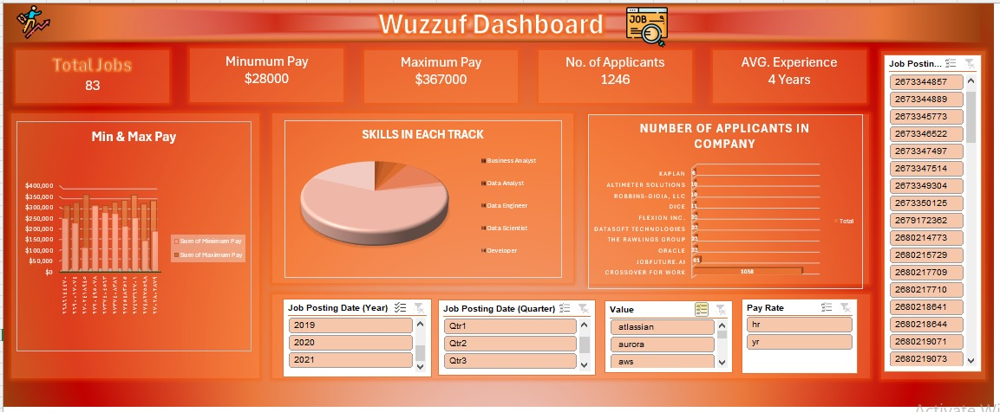

# 📊 Wuzzuf Dashboard – Excel Data Analysis Project

## 📌 Project Overview
An interactive Excel dashboard built to analyze **Wuzzuf job posting data** and provide insights into salaries, applicants, required skills, and hiring trends.

---

## 🚀 Features
- KPI Cards for:
  - Total Jobs
  - Minimum Pay
  - Maximum Pay
  - Number of Applicants
  - Average Experience

- Salary Analysis:
  - Min & Max Pay Comparison

- Skills Analysis:
  - Skills Distribution Across Career Tracks

- Applicants Analysis:
  - Number of Applicants by Company

- Interactive Filters / Slicers:
  - Job Posting ID
  - Posting Year
  - Quarter
  - Skills / Technologies
  - Pay Rate

---

## 🛠 Tools & Techniques Used
- Microsoft Excel
- Pivot Tables
- Pivot Charts
- Slicers
- Conditional Formatting
- Dashboard Design
- Data Cleaning & Preparation

---

## 📈 Key Insights
- Identified salary ranges across job postings  
- Compared applicant counts among companies  
- Highlighted most required skills in each career track  
- Tracked hiring trends by year and quarter  

---

## 💡 Skills Demonstrated
- Data Analysis  
- Data Visualization  
- Dashboard Development  
- Business Intelligence  
- Exploratory Data Analysis (EDA)  

---

## 📂 Dataset
Wuzzuf Job Market Dataset

---

## 📸 Dashboard Preview

---

---

## 🎥 Project Demo
[Watch Project Explanation Video](https://drive.google.com/file/d/1IFEWFWzox4qL0kOcTOVy3yn9xpaCSFG6/view?usp=drivesdk)

## 👩‍💻 Connect With Me
- LinkedIn: [Alaa Ayman Ramadan](www.linkedin.com/in/alaa-ramadan-)
